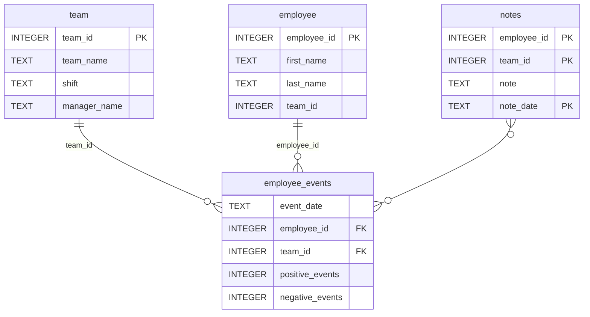

# Software Engineering for Data Scientists 

This repository contains the completed project for the **Software Engineering for Data Scientists** final project. The project includes a Python package for database access and a FastHTML-based employee events dashboard.

---

## Setup

### Prerequisites

- Python 3.10
- `venv` or any virtual environment manager

### 1. Create and activate a virtual environment

```bash
python -m venv venv
# Windows
.\venv\Scripts\activate
# macOS / Linux
source venv/bin/activate
```

### 2. Install dependencies

```bash
pip install -r requirements.txt
```

---

## Run the Dashboard

```bash
cd report
python dashboard.py
```

Open in your browser: [http://localhost:5001](http://localhost:5001)

The dashboard displays employee and team data from `employee_events.db` including:
- Cumulative positive/negative event line chart
- Predicted recruitment risk bar chart
- Notes table

---

## Run Tests

```bash
pytest
```

---

### Repository Structure
```
├── README.md
├── assets
│   ├── model.pkl
│   └── report.css
├── env
├── python-package
│   ├── employee_events
│   │   ├── __init__.py
│   │   ├── employee.py
│   │   ├── employee_events.db
│   │   ├── query_base.py
│   │   ├── sql_execution.py
│   │   └── team.py
│   ├── requirements.txt
│   ├── setup.py
├── report
│   ├── base_components
│   │   ├── __init__.py
│   │   ├── base_component.py
│   │   ├── data_table.py
│   │   ├── dropdown.py
│   │   ├── matplotlib_viz.py
│   │   └── radio.py
│   ├── combined_components
│   │   ├── __init__.py
│   │   ├── combined_component.py
│   │   └── form_group.py
│   ├── dashboard.py
│   └── utils.py
├── requirements.txt
├── start
├── tests
    └── test_employee_events.py
```

### employee_events.db


